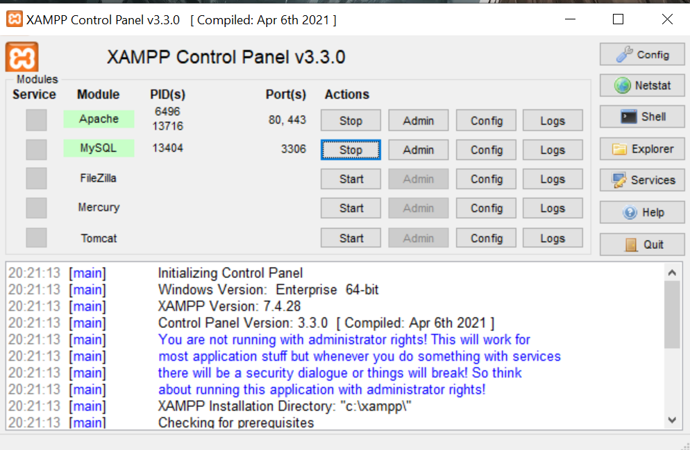
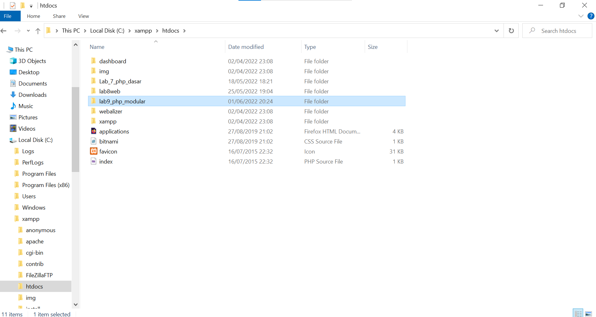
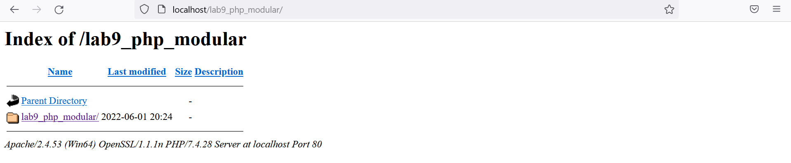
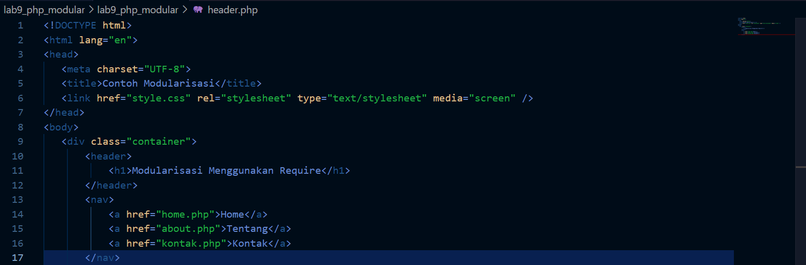
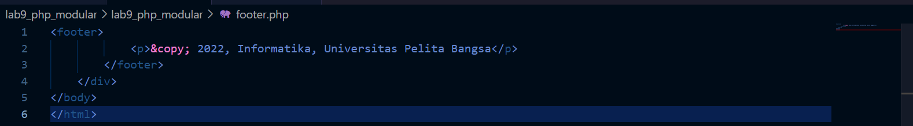
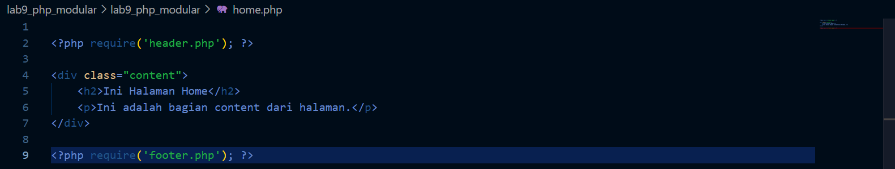
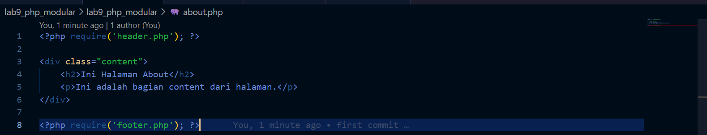
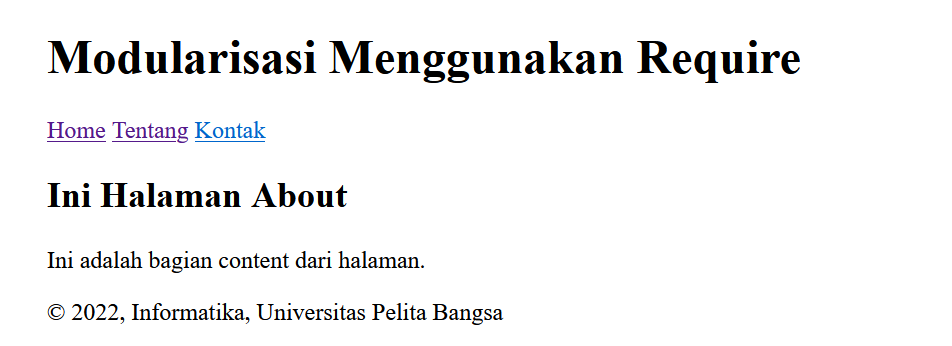

# Nama      : Risky HariAdi
# Nim       : 312010124
# Kelass    : TI.20.A1

## PERTEMUAN 11
## LAB 9 WEB
## PRAKTIKUM 9

# LANGKAH - LANGKAH PRAKTIKUM

# 1. MENJALANKAN XAMPP SERVER



PENJELASAN 

MENJALANKAN XAMMP SERVER LOCALHOST

# 2. MEMBUAT FOLDER BARU DENGAN NAMA LAB9_PHP_MODULAR



PENJELASAN

Kemudian jalanlan pada localhost server dengan mengakses URL: http://localhost/lab9_php_modular/



# 3.MEMBUAT FILE BARU DENGAN NAMA header.php


PENJELASAN

Buat header seperti contoh di atas

code header

```html
<!DOCTYPE html>
<html lang="en">
<head>
   <meta charset="UTF-8">
   <title>Contoh Modularisasi</title>
   <link href="style.css" rel="stylesheet" type="text/stylesheet" media="screen" />
</head>
<body>
   <div class="container">
       <header>
           <h1>Modularisasi Menggunakan Require</h1>
       </header>
       <nav>
           <a href="home.php">Home</a>
           <a href="about.php">Tentang</a>
           <a href="kontak.php">Kontak</a>
       </nav>
```
Dan ini adalah bentuk gambarnya



# 4. MEMBUAT FILE BARU DENGAN NAMA footer.php

PENJELASAN

Buat footer.php dan code nya

code footer
```html
<footer>
            <p>&copy; 2022, Informatika, Universitas Pelita Bangsa</p>
        </footer>
    </div>
</body>
</html>
```
Dan ini Hasil gambar nya


 
# 5.MEMBUAT FILE BARU NAMA home.php


PENJELASAN

Buat home.php dan code nya

code home
```php

<?php require('header.php'); ?>

<div class="content">
    <h2>Ini Halaman Home</h2>
    <p>Ini adalah bagian content dari halaman.</p>
</div>

<?php require('footer.php'); ?>

```
dan ini adalah hasil gambar nya



# 6 . MEMBUAT FILE BARU DENGAN NAMA FILE about.php

Buat about.php dan code nya

code about
```php
<?php require('header.php'); ?>

<div class="content">
    <h2>Ini Halaman About</h2>
    <p>Ini adalah bagian content dari halaman.</p>
</div>

<?php require('footer.php'); ?>

```
dan ini adalah codingan gambar nya



# 7.TAMPILAN DI BROWSER NYA

1. Tampilan home page pada browser yang menggunakan modular header dan footer


2. Tampilan about page pada browser yang menggunakan modular header dan footer



# SEKIAN DAN TERIMAKASIH
